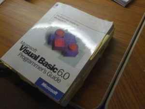

## A thousand steps to nowhere...

I think the first programming language I really started writing code in was Visual Basic 6. I had done some scripting previously in AutoCAD for simple things and I had done some VBA in Office, but VB6 was when I first wrote stuff that was taken seriously (sorta). I remember I picked up the official [Microsoft Visual Basic 6 .0 Programmer's Guide](http://www.amazon.com/gp/product/1572318635/ref=as_li_ss_tl?ie=UTF8&camp=1789&creative=390957&creativeASIN=1572318635&linkCode=as2&tag=odoenet-20) and read that beast of a book from cover to cover, thrashing it with sticky notes and bookmarks.

I was pretty proud of myself. I was tasked with building a [MapObjects](http://www.esri.com/software/mapobjects) prototype application at work that would display some basic GIS data and pull some attribute information. I thought I was awesome, as I had this demo up and running, showing proof of concept stuff to my boss and peers. Then the feedback came in. People were impressed, they wanted to add features, change some things around to meet their needs. At first, I (foolishly) said sure, I can do that. So I went back to my desk, opened Visual Studio and stared blankly at a single Visual Basic file with hundreds of lines of code, maybe more and wondered to myself, what have I got myself into...

## Not alone, I hope

I like to think I am not the only developer who started off writing all my code in a single file only to realize that when I needed to make changes or fix something, I was jumping around from a reference on line 23 to where it is changed again on like 892. (I hope I'm not the only one). In many ways, I'll still do this when learning a new language or framework, but never on a big project, just as an exercise. Instead, I have learned over the years to break my code up into manageable pieces. Flex development was my main thing for quite a while, and I think I picked up some [very good habits](http://joelhooks.com/2010/05/02/modular-robotlegs/) from that community. Smaller bits of code, broken up into modules is easier to test, easier to read (no hundreds of lines of code to swim in) and most importantly, easier to maintain.

## Go modular or go...

Smarter people than myself have written about modular JavaScript development. Here is a [free design pattern book](http://addyosmani.com/resources/essentialjsdesignpatterns/book/) to get you started. There is a great book called [Learning JavaScript Design Patterns](http://www.amazon.com/gp/product/1449331815/ref=as_li_ss_tl?ie=UTF8&camp=1789&creative=390957&creativeASIN=1449331815&linkCode=as2&tag=odoenet-20) that might also interest you.

Previously, the ArcGIS JavaScript API was built on Dojo 1.6 and I was [advocating the use of Require.js](http://odoe.net/blog/?tag=require-js) to build out your ArcGIS JS apps in a modular fashion. Require.js uses the [AMD style](http://www.sitepen.com/blog/2012/06/25/amd-the-definitive-source/) of modular development. With the upgrade of the ArcGIS JavaScript API to support Dojo 1.7, some big changes came, mostly in the fact that Dojo was now using AMD style modules. I think this has left some ArcGIS JavaScript developers scratching their heads as to how to move forward, especially if the need comes up where you are required to update an older application to the new API.

Here is an example of the core change from API updgrades. \[cce lang="javascript"\] // Dojo 1.6, ArcGIS API < 2.x dojo.require('esri.tasks.Identify');

// Dojo 1.7, ArcGIS API > 3.x define(\['esri/tasks/identify'\], function() { // ... do some stuff ... // Adds esri.tasks.IdentifyTask() // Notice I don't declare a variable name // for the IdentifyTask. The ArcGIS API actually // appends IdentifyTask to the global esri.tasks // object when you include it in your dependency // list. No need to declare a variable name in your // function. A lot of the API works this way. }); \[/cce\]

Someone new to the AMD style could look at this and wonder, why in the world would I do this? I'll quote what I think are key points from the [Require.js documentation](http://requirejs.org/docs/whyamd.html) on the subject.

> Clear declaration of dependencies and avoids the use of globals. Defines a way to include multiple modules in one file.

## This is sounding familiar

If you've read my blog (no one reads my blog) this may all sound familiar. That's because I discussed it [before](http://odoe.net/blog/?p=257). And [again](http://odoe.net/blog/?p=307) when the ArcGIS JavaScript 3.0 API was released. My point is, I think this is important for us as developers in the community. If you are using the ArcGIS JavaScript API for development, these are the kinds of issues you will need to do deal with.

## Some resources

The ArcGIS Resource center does have some info up on [migrating your development](http://help.arcgis.com/EN/webapi/javascript/arcgis/help/jshelp/migration_30.htm) to the new Dojo 1.7. It is not incredibly comprehensive, but it's a start.

Some may argue, "AMD is bad, CommonJS is good", which is all fine and dandy, but seeing as we're already using Dojo and Dojo uses AMD loading, embrace the AMD.

I would also recommend the following links to specific Dojo documentation. [Configuring Dojo with dojoConfig](http://dojotoolkit.org/documentation/tutorials/1.7/dojo_config) [Defining Modules](http://dojotoolkit.org/documentation/tutorials/1.7/modules) [Modern Dojo](http://dojotoolkit.org/documentation/tutorials/1.7/modern_dojo/) [Using Custom AMD Modules with a CDN](http://dojotoolkit.org/documentation/tutorials/1.7/cdn)

If you devote some time to learning pure Dojo, I guarantee you will find yourself becoming a better ArcGIS JS developer. I have eliminated (so far) my dependencies on any third-party JavaScript libraries other than Dojo for my current projects. I have found over this past year that although many libraries offer some very nice features ([Backbone](http://backbonejs.org/)), they weren't really required for the work I do. Personally, I had set a goal for myself to be more of a minimalist in my JavaScript development. Use the right tool for the job, but you don't always need a new toolbox.

## Where's the code?

I was getting ready to prepare a sample application to demonstrate how to build a modular application, but then I realized that just about all my samples are built in a modular fashion. Just take a glance at [my github page](https://github.com/odoe) for some examples.
