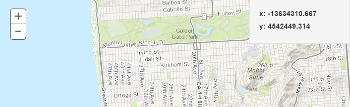

I really enjoy experimenting with frameworks and libraries. Even back when I was doing ActionScript dev, I was a big fan of [Swiz](http://odoe.net/blog/custom-geocodeprocessor-with-swiz/) and [Robotlegs](http://odoe.net/blog/esri-flex-map-with-robotlegs/). When it comes to JavaScript frameworks, I try to give each one a shot, from [Backbone](http://odoe.net/blog/getting-modular-with-the-arcgis-javascript-api/) to [Knockout](http://odoe.net/blog/knockout-js-and-why-flex-devs-should-try-it/) and [Angular](http://odoe.net/blog/using-angularjs-with-arcgis-api-for-javascript/). One library I have really grown to enjoy has been [React](http://facebook.github.io/react/). React is the hotness these days. One of the reasons is it's use of the [Virtual DOM](http://facebook.github.io/react/docs/glossary.html) which should not be confused with [Shadow DOM](http://w3c.github.io/webcomponents/spec/shadow/). Basically because of the way React does redraws, it's fast. It may not be the [fastest](http://lhorie.github.io/mithril/benchmarks.html), but it has a very active community.

### But what about Dojo?

React is not an [MVC](http://en.wikipedia.org/wiki/Model%E2%80%93view%E2%80%93controller) framework. React is closer to the _V_ in MVC on steroids. For example, it's been pretty popular in replacing views in [Backbone](http://www.thomasboyt.com/2013/12/17/using-reactjs-as-a-backbone-view.html). **So why can't we do the same with Dojo?** If you are using [EsriJS](https://developers.arcgis.com/javascript/) to build your mapping applications, you are probably used to using the [Dijit](http://dojotoolkit.org/reference-guide/1.10/dijit/) library to build out widgets. This works great and is battle-tested. But what if you wanted to stick some React in there to replace that Dijit layer of your application? _That's not difficult to do_.

Before we dive in, let's talk a little about how React is typically used in application development. From what I have seen other developers do and how I have followed in my development is that React is used to build many simple components that can be composed together to build an interactive user interface. Think of something like iTunes with it's many rows of songs grouped by artists/albums. Each of those pieces could be a React component. It's a good methodology to follow whether you are using React or Dijit.

### Show me the goods

This is the sample I put together. The repo for this sample can be seen [here](https://github.com/odoe/esrijs-react). This sample will simply display the _xy_ coordinates of the mouse as you move it around the map. \[caption id="attachment\_775" align="aligncenter" width="694"\] Image of sample application\[/caption\]

You may notice some oddness in a couple of the files in the repo where I'm mixing HTML with my JavaScript. That's [**JSX**](http://facebook.github.io/react/docs/jsx-in-depth.html). _JSX is totally optional when working with React_, but it's nice to use so you can easily see the structure of your component.

I'm going to skip over the basics of the app in setting up the EsriJS stuff and go right to the React.

\[gist id=3b852bec36a41537cee7\]

This is a simple container I'll use to add DOM element to the page that will hold the widget. This is just a preference of mine, but I find it helps to keep things a little more organized for me.

\[gist id=odoe/82cbf62422def3350cd0\]

You may notice there is no Dojo or EsriJS stuff brought into this widget. The only thing non-React in here is the map that was passed as part of the properties to the widget. You can listen for the [mouse-move](https://developers.arcgis.com/javascript/jsapi/map-amd.html#event-mouse-move) event of the map and update the _xy_ of the state of the widget. _State_ is pretty important in React. Using the [setState](http://facebook.github.io/react/docs/component-api.html) method will update the coordinates and _rerender_ the component with the new state. I won't get into details on the differences between _state_ and _props_ in React, but you can think of props as configuration for the component and state as the data that may change. [Here is a good writeup on the subject](https://github.com/uberVU/react-guide/blob/master/props-vs-state.md).

### That's it

Integrating React with Dojo isn't very difficult at all. This widget works great and can be incorporated just about anywhere I may want that functionality. To use this sample you will need to use [gulp](http://gulpjs.com/) as the build tool to convert the JSX into plain JavaScript and [bower](http://bower.io/) is used to add React to the application.

I would highly suggest you read through some of the [React docs](http://facebook.github.io/react/docs/interactivity-and-dynamic-uis.html) and the videos from the recent [ReactConf](http://www.youtube.com/user/reactconf) when you have the chance.

Don't be afraid to mix and match your libraries if you want to. _I may espouse pure Dojo development when working with EsriJS_, but that doesn't mean you shouldn't mix things up once in a while. Hack away and enjoy!

**Note** - I did a follow up to this post on [GeoNet](https://geonet.esri.com/people/odoe/blog/2015/04/01/esrijs-with-reactjs-updated) with a more involved sample.
