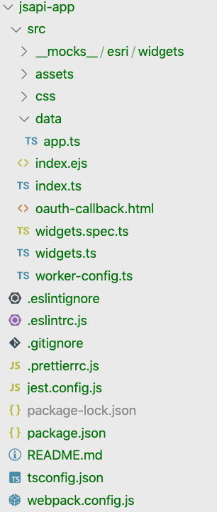
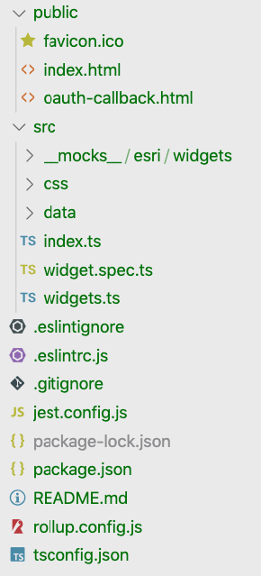

The [latest release](https://github.com/Esri/arcgis-js-cli/releases/tag/4.14.0) of the [@arcgis/cli](https://github.com/Esri/arcgis-js-cli) has some significant updates to the template apps that it will output.

## Default Application

First off the default app has been completely simplified so there is no reliance on the API widget framework. It just sets up a basic application using webpack to for the builds.

arcgis create jsapi-app

In this update, it will also use [Jest](https://jestjs.io/) for testing. They look like tests. Nothing to fear here.

describe('widgets', () => {
  beforeEach(() => {
    spy = jest.spyOn(document, 'getElementById');
    const mockElem: any = {
      offsetWidth: 300,
    };
    spy.mockReturnValue(mockElem);
  });

  it('initializes widgets in view', () => {
    const widgets: any\[\] = \[\];
    const view: any = {
      ui: {
        add(w: any) {
          widgets.push(w);
        },
      },
    };
    initWidgets(view);
    expect(widgets).toHaveLength(2);
  });
});

You can see the default application in action [here](https://jsapi-app-default-414.surge.sh/).

## Default Application with CDN

I had received a couple of requests from users to provide a template application with the cli that uses the [ArcGIS API for JavaScript](https://developers.arcgis.com/javascript/) CDN. In this case, these users simply wanted to use the CDN, write their applications in TypeScript and have minimal build steps, so no real use for webpack in this scenario.

To minimize the complexity and build steps, these applications will use [rollup](https://rollupjs.org/) to compile the TypeScript and output results to a folder. rollup is nice because the configuration is very minimal.

arcgis create jsapi-app-cdn --cdn

Here is what the rollup.config.js looks like.

// rollup.config.js
...
// Builds based on environment
const OUTPUT = process.env.BUILD === 'development' ? 'output/dev' : 'output/dist';
const SOURCEMAP = process.env.BUILD === 'development' ? 'inline' : false;
const MINIFY = process.env.BUILD === 'development' ? null : terser();
const SERVER = process.env.BUILD === 'development' ? \[serve(OUTPUT), livereload(OUTPUT)\] : \[\];

export default {
  input: './src/index.ts',
  output: {
    dir: OUTPUT,
    format: 'amd',
    sourcemap: SOURCEMAP
  },
  plugins: \[
    del({ targets: OUTPUT }),
    eslint({
      fix: true,
      exclude: \['node\_modules/\*\*', 'src/\*\*/\*.css'\]
    }),
    typescript(),
    MINIFY,
    postcss({
      extensions: \['.css'\],
      extract: true
    }),
    copy({
      targets: \[{ src: 'public/\*\*/\*', dest: OUTPUT }\]
    }),
    ...SERVER
  \]
};

The key here is to let rollup bundle your application code in **amd** format. Then you can use the ArcGIS JSAPI amd loader to load your application code.

  
  

The benefit here is that you can write your application in TypeScript, without having to worry too much about the build steps or all the different plugins normally associated with webpack builds. This rollup configuration has a handful, but not nearly as much as webpack does.

I was initially going to just use npm scripts, but also wanted to provide minification and other steps for [postcss](https://postcss.org/) and [livereload](http://livereload.com/) for dev. If I didn't use rollup, it would have involved writing a series of npm scripts and running them in parallel and other hackery that I felt wasn't very clean.

You're lucky I didn't just use a **makefile**.

The application builds are also silly fast, because yes, the JSAPI is big, so using the CDN and omitting it from the build step, just makes for faster builds. You're welcome.

You can view the CDN application [here](https://jsapi-app-cdn-414.surge.sh/). It looks the same as the default application, except it loads the JSAPI via CDN. Yay.

## Calcite App

A brand new addition to the cli is a template for using [calcite-app-components](https://esri.github.io/calcite-app-components). Hereby referred to as CAC. CAC is a collection of web components that you can use in your own applications. Keep in mind, they are mainly designed for Esri application development, but stuff like that hasn't stopped many users from using calcite stuff before.

arcgis create jsapi-app-calcite -t calcite

The application structure will look a lot like the default app, except the **index.html** file will have a lot more stuff in it.

<calcite-shell>
    <calcite-shell-panel id="widget-panel" slot="primary-panel" layout="leading">
        <calcite-action-bar slot="action-bar">
          <calcite-action-group>
            <calcite-action text="Legend">
            </calcite-action>
            <calcite-action text="Layers">
            </calcite-action>
          </calcite-action-group>
        </calcite-action-bar>
      </calcite-shell-panel>
  

  

  

  <footer slot="shell-footer">
  </footer>
</calcite-shell>

It will look similar to the above. These are a number of calcite web components to structure the application UI. It's a lot of fun to work with!

This application will use webpack to do a custom build with the JavaScript API, CAC, and the rest of your app.

You can check out the calcite application [here](https://jsapi-app-calcite-414.surge.sh/).

## Calcite App with CDN

And of course, you can also scaffold the same application using the CDN!

arcgis create jsapi-app-calcite-cdn -t calcite --cdn

The application looks the same as the regular calcite application, but the JSAPI and calcite components are loaded via CDN. The application itself is really no different. Trust me, you can view it [here](https://jsapi-app-calcite-cdn-414.surge.sh/). I wish there was more I could say about it, but it looks the same, your code is the same, it's just built differently.

## Summary

You have a lot of choices now when scaffolding applications with the @arcgis/cli.

- Default app
- Default with CDN
- Calcite App
- Calcite App with CDN
- React App
- Vue App

That's a lot of options! Which one should you go with? That's up to you. The default app is a great way to get started from scratch with the ArcGIS API for JavaScript. The build tooling is already preconfigured for you with webpack and more and you can scale it pretty easily.

The calcite version includes a pretty robust UI library built on web components, which makes it pretty flexible.

In both cases you can use the CDN version which will lead to faster build times and a smaller deployed footprint if that is a concern. I think it's pretty snappy and I'll probably use it for smaller projects.

The React and Vue options are there if you want a full blown framework experience to build your applications, so knock yourself out!

The choice is yours, but whatever you decide to do, I know you'll be awesome at it!
