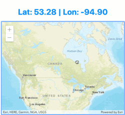

If you haven't seen it yet, Rich Harris of the New York Times did a [presentation](https://www.youtube.com/watch?v=AdNJ3fydeao) on the latest release of [Svelte](https://svelte.dev/). Svelte has been around for a little while and it's not really a framework. It's a compiler that can introspect your code and do some really interesting things, such as know when you are using something as state for your DOM.

That's another interesting bit in today's JavaScript landscape is that Svelte [does not use a virtual DOM](https://svelte.dev/blog/virtual-dom-is-pure-overhead), it updates the DOM in place based on how you are using it.

Since its latest release, I have gotten a number of questions on how it can be used with the ArcGIS API for JavaScript. I enjoy doing these mashups, so I spent some time simply around integration.

## Getting Started

When you first install your Svelte application, it's silly simple to add the ArcGIS API for JavaScript. Go into the public folder and add the script tag to the head of the index.html file.

<head>
	<meta charset='utf8'>
	<meta name='viewport' content='width=device-width'>
	<title>Svelte app</title>
	<link rel='stylesheet' href='global.css'>
	<link rel='stylesheet' href='bundle.css'>
        <link rel="stylesheet" href="https://js.arcgis.com/4.11/esri/themes/light/main.css">
	
</head>

Once you do that, you can directly into the App.svelte file and use the AMD loader of the API to load your mappy stuff.

<!-- src/App.svelte -->

    <h1>{centerText}</h1>
    

So yeah, Svelte has a file extension. If you've used Vue, this probably seems really familiar to you. Your editor may complain about not having the typings for _require_ installed, but that can be ignored.

_Side note_ - I can see the benefits of this for developers to keep all their component logic, styles, and UI in the same place, and if you're already doing css-in-js, you can't complain about this! I'm not sure I'm a big fan, but again, I don't use Svelte or Vue on a regular basis.

At this point, it just works. You should have an app that looks like this.

Ok, so that's cool... but it could be cooler.

## Let's be cooler

Svelte doesn't use webpack, it uses [rollup](https://rollupjs.org/guide/en). This makes things so much easier for us.

In the rollup.config.js, let's change the output to amd.

// rollup.config.js
...
output: {
  sourcemap: true,
  format: 'amd',
  name: 'app',
  file: 'public/bundle.js'
},
...

Now we can update the index.html page to use the AMD loader of the ArcGIS API for JavaScript to load the module that Svelte will create.

</head>
<body>

</body>

I'll create a file that will handle all my ArcGIS API for JavaScript code separate from Svelte.

// src/initMap.js
export async function initmap() {
  const [Map, MapView] = await Promise.all([
    import("esri/Map"),
    import("esri/views/MapView")
  ]);

  const map = new Map({
    basemap: "streets"
  });

  const view = new MapView({
    container: "viewDiv",
    map: map,
    zoom: 4,
    center: [15, 65]
  });

  return view;
}

Now I can use it in my Svelte file.

// App.svelte

And my application will look the same!

You can see the [source code for this application on github](https://github.com/odoe/jsapi-svelte).

## Summary

At the end of the day, it's not really difficult to integrate the ArcGIS API for JavaScript with Svelte. I like what Svelte is doing, I think it's got JavaScript developers thinking and keeping everyone on their toes. It doesn't really have a good TypeScript story at the moment unfortunately, but I think they are working on it!

So go on, give it a shot, have some fun and try something new!
