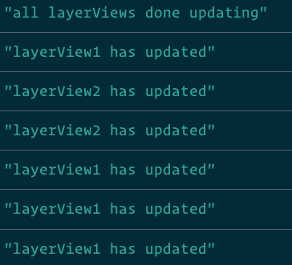

I've seen this question pop up a couple of times in regards to the ArcGIS API for JavaScript. The question is usually along the lines of _When is the layer done drawing?_ That's a valid question, so let's talk about it.

If we look at the [Programming Patterns](https://developers.arcgis.com/javascript/latest/guide/programming-patterns) documentation, we can see that we'll probably want to [watch for some property changes](https://developers.arcgis.com/javascript/latest/guide/programming-patterns/#watching-for-property-changes) to happen. The big question is, _which properties?_

## Some fundamentals

You are most likely interested in when a [FeatureLayer](https://developers.arcgis.com/javascript/latest/api-reference/esri-layers-FeatureLayer.html) has not only loaded the data it currently needs, but also when that data has been drawn on the map. If we look at the [Map and Views](https://developers.arcgis.com/javascript/latest/guide/maps-and-views/) guide, we can see that the map and layers are basically data models for our applications. They don't actually draw anything, so we most likely don't want to interact with them directly if we are interested in when they are done drawing.

It's important to note how the flow of data to what you see works.

_**Map -> View -> LayerViews**_

For every layer in a map, a [LayerView](https://developers.arcgis.com/javascript/latest/api-reference/esri-views-layers-LayerView.html) is created. The LayerView is in charge of determining what data it needs to ask the layer to fetch and taking the renderer information and drawing that data. For a FeatureLayer, you would have a [FeatureLayerView](https://developers.arcgis.com/javascript/latest/api-reference/esri-views-layers-FeatureLayerView.html). Now, if you are interested when data is done drawing on the map, this is what you are looking for!

## FeatureLayerView

There are a couple of ways to get the LayerViews of the MapView or SceneView. You can use the [whenLayerView()](https://developers.arcgis.com/javascript/latest/api-reference/esri-views-layers-FeatureLayerView.html) method, or listen for the [layerview-create event](https://developers.arcgis.com/javascript/latest/api-reference/esri-views-MapView.html#event-layerview-create). I prefer to be specific and use the whenLayerView method, so I know what I'm getting.

view.whenLayerView(featureLayer)
  .then((layerView) => {
    return watchUtils.whenFalseOnce(layerView, 'updating');
  })
  .then((newValue, oldValue, prop, layerView) => {
    console.log('layerView is done loading and drawing', layerView);
  });

The key is to watch for the [layerView.updating](https://developers.arcgis.com/javascript/latest/api-reference/esri-views-layers-FeatureLayerView.html#updating) property to be false. When it's false, that means the LayerView is done fetching data and done drawing that data.

You could also do this using async/await!

async function whenDone() {
  const layerView = await view.whenLayerView(featureLayer);
  await watchUtils.whenFalseOnce(layerView, 'updating');
  console.log('layerView is done loading and drawing', layerView);
}

Most of the time, I'm interested in just the first time the layer loads in an application, so I use [whenFalseOnce](https://developers.arcgis.com/javascript/latest/api-reference/esri-core-watchUtils.html#whenFalseOnce) of the watchUtils to check the first time it happens. If you are interested in every time the LayerView is done updating, you could use [whenFalse](https://developers.arcgis.com/javascript/latest/api-reference/esri-core-watchUtils.html#whenFalse) to keep an eye on it.

If I'm interested in checking on a couple of layers, I could use Promise.all to find out when both are done and also watch for any more changes.

  let layerView1
  let layerView2;
  Promise.all(\[
    view.whenLayerView(fLayer),
    view.whenLayerView(fLayer2)
  \]).then((\[lyrView1, lyrView2\]) => {
      layerView1 = lyrView1;
      layerView2 = lyrView2;
      return Promise.all(
        \[
          whenFalseOnce(layerView1, "updating"),
          whenFalseOnce(layerView2, "updating")
        \]
      );
  }).then(() => {
    console.log("all layerViews done updating");
    whenFalse(layerView1, "updating", () => {
      console.log("layerView1 has updated");
    });
    whenFalse(layerView2, "updating", () => {
      console.log("layerView2 has updated");
    });
  });

You can see what this example looks like here.

<iframe height="461" style="width: 100%;" scrolling="no" title="LayerView - When Things are Done" src="https://codepen.io/odoe/embed/preview/gOpadzL?height=461&amp;theme-id=light&amp;default-tab=js,result" frameborder="no" allowtransparency="true" allowfullscreen="true">See the Pen <a href='https://codepen.io/odoe/pen/gOpadzL'>LayerView - When Things are Done</a> by Rene Rubalcava (<a href='https://codepen.io/odoe'>@odoe</a>) on <a href='https://codepen.io'>CodePen</a>. </iframe>

This example is interesting because if you zoom out so one of the layers is no longer drawn, you can see that the LayerView updating property will not change, because it does not need to fetch or draw anything.

## Summary

You may not always need the fine-grained control of knowing when layers are done fetching data or when that data is drawn on the map, but you can! The LayerViews are powerful tools in the ArcGIS API for JavaScript. They manage your layers and when things are drawn, so keep that in mind and you can do some cool stuff! Because they are in charge of drawing your data, you can also apply [filters](https://developers.arcgis.com/javascript/latest/api-reference/esri-views-layers-FeatureLayerView.html#filter) and [effects](https://developers.arcgis.com/javascript/latest/api-reference/esri-views-layers-FeatureLayerView.html#effect)!

Have fun and happy map hacking!
