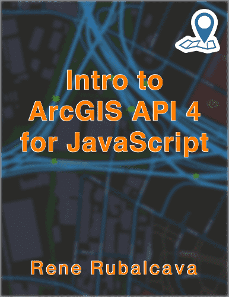

---

title: "2017 Goals: Hope Is Not a Strategy"
published: true
author: Rene Rubalcava
pubDate: 2016-12-28
tags: geodev
heroImage: '../../assets/blog/2017-goals-hope-not-strategy/images/goals2017.jpg'
description: One of my favorite quotes recently comes from Chris Voss, author of
  Never Split the Difference. That quote is in the title of this post, _Hope is
  not a strategy._ That's how I want to approach my future goals. I can't _hope_
  I'll get to them. I need a plan and I need some milestones. I'll give you a
  rough idea of those goals today.
---

One of my favorite quotes recently comes from Chris Voss, author of
[Never Split the Difference](http://amzn.to/2hu7Fqs). That quote is in the title
of this post, _Hope is not a strategy._ That's how I want to approach my future
goals. I can't _hope_ I'll get to them. I need a plan and I need some
milestones. I'll give you a rough idea of those goals today.

## Year in review

2016 was quite the year.

[Here](https://odoe.net/blog/2016-goals-more-cowbell/) are my 2016 goals. I've
met quite a few of those.

I think I'm cool flying... _maybe_. I've flown a few times this year for work,
with my longest trip being to Berlin for the Esri European Developer Summit.
That was 12-13 hours each way, so after that, I feel less anxious flying now.
Work at Esri has been going great, I have my hands in various projects and I'm
loving it. I'm definitely kept busy.

I've been blogging consistently, on a weekly basis. I've also been doing a lot
more [YouTube videos](https://www.youtube.com/c/ReneRubalcava) this past year. I
think I'm getting pretty good at it. I have some other ideas for video projects
coming up this year that should be interesting. I have been republishing some
videos on
[GeoNet](https://geonet.esri.com/community/developers/web-developers/arcgis-api-for-javascript/content?filterID=contentstatus%5Bpublished%5D~objecttype~objecttype%5Bvideo%5D).

I'm almost _done_ with the
[Intro to ArcGIS API 4 for JavaScript](https://leanpub.com/arcgis-js-api-4) book
I self-published. It's tough to say when it's _done_ **done**. The book will be
updated throughout the whole 4.x lifecycle of the API, which is part of the
reason I wanted to self-publish, but it also makes it difficult to call it
_finished_ at any given moment. I've really enjoyed working on this project.

## Coming up

Let me try to clarify some goals for 2017.

### Blogging

This is my core blog and I'll keep putting out new content on a weekly basis.
I'm going to also work towards putting out a blog article in addition to video
on a weekly basis. I've been looking at pushing more content to
[Medium](https://medium.com/@odoenet) too, maybe even for some content that
wouldn't quite fit into the geo-specific topics I cover here. With a little more
planning, I think I can manage it. I might even use it for some book reviews, I
typically do 3-4 books a month.

### Writing

[Intro to ArcGIS API for JavaScript 4](https://leanpub.com/arcgis-js-api-4) has
been coming along really well.

I'll have an update out next week to cover some features added in the 4.2
release. Like I said before, it's a little tough to call it done at any given
point, but I think by the time the Palm Springs DevSummit rolls around, I'll
call it _content-complete_. That will mean it will be done and will just receive
updates based on new features added in the API.

One thing I've been working on in my spare time is an outline for an email
course. Email courses are pretty interesting and I think can help me reach more
developers. As this comes together I'll talk more about it. It's looking like
this will happen around February or March of 2017.

### Videos

As I talked about, I think I'm getting pretty good at
[making videos](https://www.youtube.com/c/ReneRubalcava). I really enjoy doing
it, and I have some plans coming up to do some more long-form stuff that should
be done in a few months. It's a little something more ambitious than I've done
before, but I think people will like it.

I've also been thinking about doing some non-geo videos on a couple of subjects.
I'm talking about between 6 to 12 hours of content videos. This is still very
rough, as it's a lot of content, but it also requires a lot of research on my
part. This is on my _maybe_ list.

### Health

Like I said last year, I now have the time during the week to hit the gym at
5am. Something I couldn't do with my old job and I hate working out in the
afternoon. I'm definitely a morning person in every sense of the word. I tried
some different kind high rep lifting the first half of the year. _I hated it_.
I've always been more of a low reps, heavy weights kind of guy, so I'm sticking
with what I know and doing more
[Dinosaur Training](http://www.brookskubik.com/products.html) style lifting. One
area of focus I'm working on is my grip strength. My lifting is fine, I just
need to avoid the _tortillas, burritos, and tacos_.

### Misc

Not much miscellaneous stuff this year. I'm staying pretty focused on the goals
I've listed. I would love to do a podcast, but I think there might be some work
conflicts involved with that. Although I might start upping my activity on
[Anchor](https://anchor.fm/), but we'll see how that plays out.

I'll be doing more conferences in 2017. In addition to Esri UC and Palm Springs
DevSummit, it looks like I'll also be at the DC DevSummit and I might even
return to Berlin in 2017 for the European DevSummit. I'll be at EmberConf in
Portland in March and I'm currenly looking for a solid JavaScript conference to
try and attend in 2017. If anyone knows of something good, please let me know.

[Subscribe](https://odoe.net/blog/sign-up/) to my weekly email to keep up to
date with the blog and any new announcements on projects I'll be working on.
