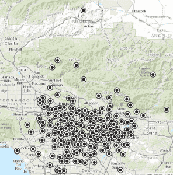
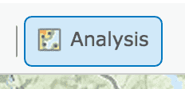
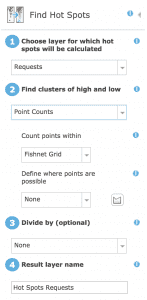
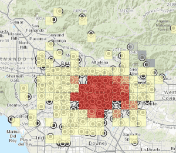
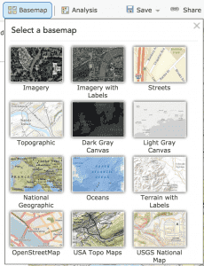
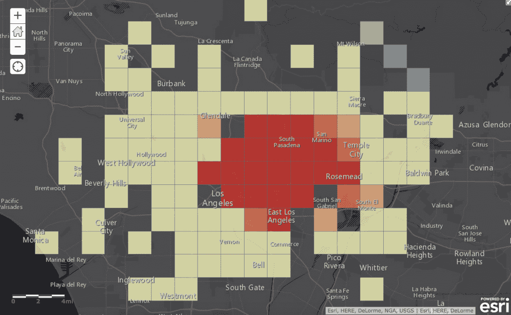
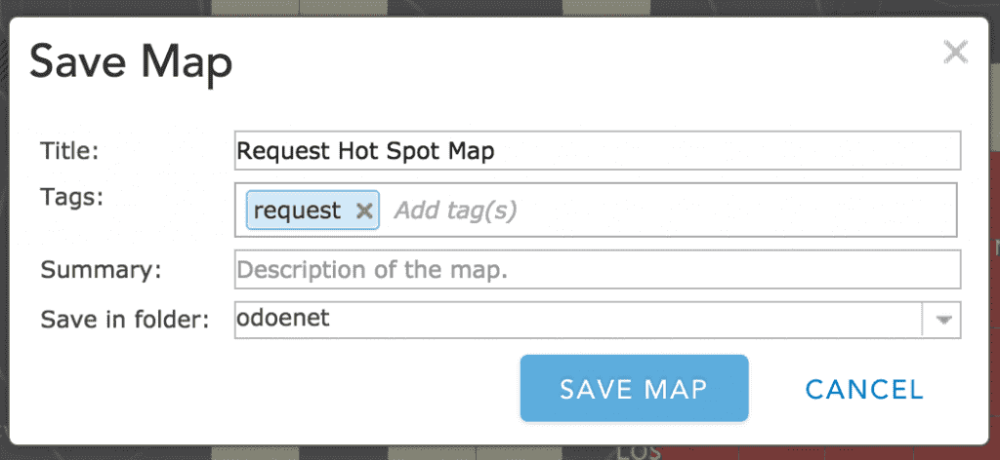
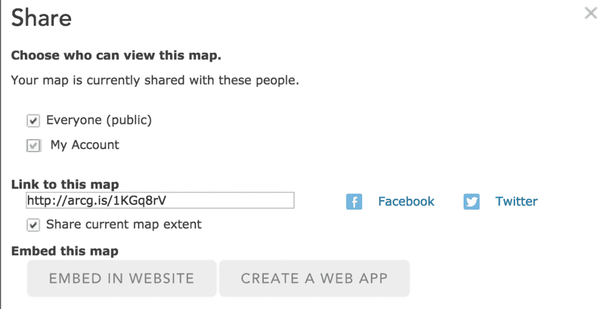

---

title: ArcGIS Online for Developers
published: true
author: Rene Rubalcava
pubDate: 2015-09-21
tags: geodev
heroImage: '../../assets/blog/arcgis-online-for-developers/images/ago.jpg'
description: There was a time where I was confused about ArcGIS Online. I was
  primarily a desktop user, an _ArcMap warrior_. I think I was still honing my
  Flex chops when ArcGIS Online was introduced. It started as an interesting
  concept, being able to share data online, having some basic map making
  features, but I didn't really think much of it at the time. As time went on, I
  begin to look at ArcGIS online and all the services it provided. As a
  developer, _I was intrigued_.
---

There was a time where I was confused about
[ArcGIS Online](https://www.arcgisonline.com). I was primarily a desktop user,
an _ArcMap warrior_. I think I was still honing my Flex chops when ArcGIS Online
was introduced. It started as an interesting concept, being able to share data
online, having some basic map making features, but I didn't really think much of
it at the time. As time went on, I begin to look at ArcGIS online and all the
services it provided. As a developer, _I was intrigued_.

However, I still see some developers struggle with ArcGIS Online and how to get
started, so I thought I would give you a quick intro on how you might be able to
take advantage of ArcGIS Online for your applications and more importantly, for
your users.

Let's cover some main points:

1. The developer account.
2. Creating data.
3. Sharing.

## Developer Account

I covered how to set up an
[ArcGIS Developer account](https://developers.arcgis.com) in detail in
[my book](https://www.manning.com/books/arcgis-web-development?a_aid=rrubalcava),
_shameless plug_. But basically, you are able to create an account that gives
you access to premium content and services with 50 credits a month. _How much
does 50 credits give you?_ It can vary based on the premium services you use
from the [Location Services](https://developers.arcgis.com/en/features/), which
is stuff like Geocoding, Routing and GeoTriggers. I can tell you this much, when
I was using my developer account to prototype applications for users, I never
ran into a credit limit issue, so 50 credits can go a long way for development
purposes. I wouldn't try generating tiles using ArcGIS Online, that's silly,
regardless of what online service you use for tiles. Generate your tiles locally
in ArcGIS desktop and then publish to ArcGIS Online and voila, you have tiles.
Editing data in ArcGIS Online doesn't use credits, so add data until your
fingers bleed.

You will want to use the developer site to add a new Feature Service, which I
won't walk you through as that portion is not too difficult and _I do walk you
through step by step in my book_. But once you have a Feature Service created,
**what do you do next?**

This is where you have some options. You can go ahead and use the Feature
Service as shown in the
[ArcGIS API for JavaScript samples](https://developers.arcgis.com/javascript/jssamples/##editing)
or really any other API, SDK or application builder as shown on the
[developers site](https://developers.arcgis.com/en/). You can also simply edit
the data in ArcGIS Online or _do something with your collected data_. Go to you
developer account, click on _Hosted Data_ and then click on your Feature
Service. You should see an _Edit in ArcGIS Online_ button in the upper right as
shown below.

## Creating Data

Now we are in an environment where you may want to create some data or maybe do
something with the data that has already been collected. If you are not familiar
with the ArcGIS Online map viewer, this may seem a bit intimidating at first,
after all there are a lot of buttons and options as you hover over items. _Don't
sweat it_, we're going to cover only what we need to. I have some data that is
just a collection of points.

Go ahead and click on the _Analysis_ button in the toolbar.

You get a new sidebar to _Perform Analysis_. This is where ArcGIS Online gets
really interesting for developers. You can now take your data that you might
have written an application for that has collected various points of interest.
That alone may be sufficient depending on what you want to use it for. But maybe
you want to do something a little more impressive with your data. ArcGIS Online
provides lots of various analysis tools you can use to make your data more
meaningful, but for now let's keep it simple and just look for some patterns.
Click on _Analyze Patterns_ and then _Hot Spots_.

![analyze-patterns]

Now you are presented with a new sidebar menu as shown below.

We'll keep the defaults to run this analysis. Now, why would I care about this
particular analysis. Let's assume my dataset is a collection of requests from
the public to fix some problem with streets. This could be a street light is
broken, stop sign missing or maybe a sidewalk damage by tree roots. A hot spot
analysis can be used as a way to visualize where activity is happening, so in
this case maybe where a city is spending money to fix problems that could help
someone make decisions such as initiate upgrades in infrastructure. This type of
analysis could be a starting point for this process.

I should also point out that just because you can perform this analysis on your
data doesn't make it valuable. The old classic,
[How to lie with maps](http://www.markmonmonier.com/how_to_lie_with_maps_14880.htm)
might be a good read if you are more interested.

At this point, you can click on the _Run Analysis_ button at the bottom of the
sidebar and wait for the analysis to finish. When done, I get a result that
looks like below.

The analysis run shows a definite red area in the center indicating a high
cluster of collected data. This map isn't very good looking yet, so let's make
it look good.

Click on the _Basemap_ button and select _Dark Gray Canvas_.

Then I'll zoom in a little bit more to the area I'm interested, turn off my
points, and get a map like below.

At this point, I'll save my map by clicking the save button, give it a name and
provide the required tags.

## Sharing

Now I'll share my map by clicking the _Share_ button. I'll share to everyone.
Now at this point, when you share a map, you also will be sharing all the
underlying data that comprises the map. You will be prompted to update the
sharing of the dependent services. So keep this in mind when sharing maps that
you aren't also sharing data you may not want to.

Now you can use this link to share with other people or use the webmap id to
bring this map into your applications. You can find the webmap id in the URL to
your webmap as shown below.

You can use this in the ArcGIS API for JavaScript by using the
[esri/arcgis/utils](https://developers.arcgis.com/javascript/jsapi/esri.arcgis.utils-amd.html)
module.

## Conclusion

This was just a quick introduction on how you as a developer can incorporate
ArcGIS Online with your free ArcGIS developer account to create more interesting
maps with your data. We barely skimmed the surface of ArcGIS Online
capabilities, but _fear not_, I have a special project underway for those
interested in getting more familiar with how they can incorporate ArcGIS Online
and their Developer account to help them build applications and provide more
value to their users. Stay tuned in the coming weeks for more information.

Until then, don't be afraid to dig into ArcGIS Online with your Developer
account and create some interesting maps, poke around the features and _get your
hands dirty!_
