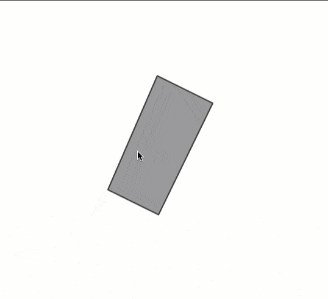

---

title: Label Features
description: How to add custom measurement labels to features
published: true
author: Rene Rubalcava
pubDate: 2021-04-26T10:00:00.000Z
heroImage: '../../assets/blog/label-features/images/cover.jpg'
tags: geodev, javascript
---

I used to work in local county government. I cut my teeth in annexations, which
is when new developments connect to county services, like sewers. This meant I
spent lots of time writing tedious legal descriptions and preparing CAD drawings
to go along with them. I've done hundreds of these. _Hundreds_. Then I had to
add these into the GIS. I only mention this, because some of the users of the
apps I wrote were used to seeing these parcels a certain way. Lots of times they
wanted quick measurements of a parcel, without using built-in measurement tools
of course. So I had implemented some features that let a user click on a parcel
and they got quick measurements of the edges. They don't need to be exact, rough
numbers were usually just fine for what users needed.

Here is an example of what this looked like.



Pretty basic.

## Making it work

The bulk of this work can be done using the
[geometryEngine](https://developers.arcgis.com/javascript/latest/api-reference/esri-geometry-geometryEngine.html).
Along with some manual parsing of polygon geometry.

The key here is to remember that Polygon geometries are made up of
[rings](https://developers.arcgis.com/javascript/latest/api-reference/esri-geometry-Polygon.html#rings).
They look something like this.

```js
[
    [ // polygon shape
        // A  -> B  ->  C  ->  A
        [...], [...], [...], [...]
    ]
]
```

You can see the rings are made up of coordinates where the last coordinate
should be the same as the first, to close up the Polygon. Things get a little
trickier when you have holes, but I'm not going down that route.

If I wanted to break this Polygon up into line segments, I basically need to
grab the coordinates from the edges to do something like this.

```
[[A -> B], [B -> C], [C -> A]]
```

That gives me three line segments. These are called Polyline
[paths](https://developers.arcgis.com/javascript/latest/api-reference/esri-geometry-Polyline.html#paths).
Once I have those Polylines, I can measure and label them!

Here's how this might look in an application.

```js
// generalize the geometry
const geometry = generalize(graphic.geometry, 0.0001, false);
// place to save Polyline centers
// use for labels
const mids = [];
// assume I have one polygon
const xys = polygon.rings[0];
const len = xys.length;
for (let i = 0; i < len - 1; i++) {
  // create a path
  const paths = [xys[i], xys[i + 1]];
  // create a Polyline
  const line = new Polyline({ paths });
  // measure the Polyline
  const len = geodesicLength(line, "feet");
  // save the Polyline center to label later
  mids.push({
    attribute: {},
    geometry: line.extent.center,
  });
}
```

This little snippet is going to do a few things. First, it will
[generalize](https://developers.arcgis.com/javascript/latest/api-reference/esri-geometry-geometryEngine.html#generalize)
the Polygon to eliminate some line segments. If not, we could have some extra
segments that we don't need for simple labeling. It's going to iterate over the
coordinates in Polygon rings and create some Polyline segments used for
measurement and to find a center to place the label.

That's not too bad. Once you've worked with arrays and pulling stuff from
locations in the array, you'll get the hang of it. You could even go through and
create Points for each vertex of the Polygon and do some client-side topology
rules and validation... _whaaaaat_.

You can see a demo of this application here.

<iframe height="400" style="width: 100%;" scrolling="no" title="Measure Polygon Lengths" src="https://codepen.io/odoe/embed/preview/VwPVyMp?height=300&theme-id=39013&default-tab=js,result" frameborder="no" loading="lazy" allowtransparency="true" allowfullscreen="true">
  See the Pen <a href='https://codepen.io/odoe/pen/VwPVyMp'>Measure Polygon Lengths</a> by Rene Rubalcava
  (<a href='https://codepen.io/odoe'>@odoe</a>) on <a href='https://codepen.io'>CodePen</a>.
</iframe>

You can watch a video where I go into more detail below!

<lite-youtube videoid="YCJjT5qi0S8"></lite-youtube>

Enjoy!
