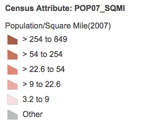

---

title: Let's get Charty!
published: true
author: Rene Rubalcava
pubDate: 2016-04-18
tags: geodev
heroImage: '../../assets/blog/lets-get-charty/images/charty.jpg'
description: People dig charts.
---

People dig charts.

They can give quick looks at your data, and may even prove enlightening. I don't
really deal with charts too often anymore, but it comes up enough that I thought
we could look at a couple of ways to get chart data using the
[ArcGIS API for JavaScript](https://developers.arcgis.com/javascript/).

I figured for this quick demo I'd take
[this Smart Mapping demo](https://developers.arcgis.com/javascript/jssamples/smartmapping_classesbycolor.html).
What makes this interesting is it uses
[Smart Mapping](https://developers.arcgis.com/javascript/jsapi/esri.renderers.smartmapping-amd.html)
to update the renderer and the legend clientside. This is typically something
you would do in Portal and save the results in your map, it's not really
efficient to be generating renderers on the fly, but hey, _it's fun!_

For my charting adventures, I decided to use [Chart.js](http://www.chartjs.org/)
because honestly it was pretty easy to use and some other libs had way too many
options for my taste. Although those more advanced libs may suit you, _I'm
keeping it minimal man._

Enough fooling around.

## Legend Charts

Legends can be cool, and they are informative. But what kind of context do they
give you at a quick glance.

[caption id="attachment_1238" align="aligncenter"
width="306"]
Simple legend[/caption]

I could read the text of the legend and figure out what it's telling me, but
let's imagine I'm lazy (I got stuff to do, I don't have time to _read_).

What if turned this legend into a chart?

That's cool! I'm sure I could do some label stuff with Chart.js, but hey, now I
can quickly see what values on my map are dominant in my map. It may not be
much, but I think that's pretty cool.

So what we're doing here is building up the dataset that Chart.js can use. We're
going to use the renderer colors to color the chart, so it's a little hacking to
parse that data into a string per data object. Then to size the dataset, we'll
divide the _maxValue_ by the _minValue_, this will give us a decent proportional
size. I tried subtracting the min from max, but it lead to some pretty weak
looking charts.

You can see this in action here.

[JS Bin on jsbin.com](http://jsbin.com/nenoga/3/embed?output)

Every time you update the data for Smart Mapping, it will update out little
legend chart. _Fun stuff right!_

## Statistics

Did you know the JSAPI comes with a little stats plugin or FeatureLayers? Yup,
it's called
[FeatureLayerStatistics](https://developers.arcgis.com/javascript/jsapi/featurelayerstatistics-amd.html)
and it's used in the Smart Mapping modules to build out histograms and other
cool stuff.

We'll go ahead and play around with the
_[getFieldStatistics](https://developers.arcgis.com/javascript/jsapi/featurelayerstatistics-amd.html#getfieldstatistics)_
method.

[gist](https://gist.github.com/odoe/95908b248a87a009e82f2a70d6388b1d.js)

This is pretty simple. You get a handful of field stats back, but I'll just show
the average and sum on this chart. Note that including the white population in
this chart kind of skews the scaling of the chart and as far as I can tell
Chart.js doesn't have a zoom method like [Plot.ly](https://plot.ly/) does. If
you take the White population out, the data makes for more readable charts. I'm
sure you could run some normalization on this, but for demo, it's cool.

Here is a working sample.

[JS Bin on jsbin.com](http://jsbin.com/xuvajo/2/embed?output)

I had trouble getting the aspect-ratio and css to play nicely, but you get the
idea.

There is so much you could do to create charts to your liking, it's silly.

This is just a basic intro to using charts in your JSAPI apps, it is by no means
extensive and doesn't take into consideration some other cool stuff you could
probably do by combining the REST API stats with the Geometry Engine to do some
really cool stuff.

So try making some charts tied to your data in your apps and get that _wow
factor!_
