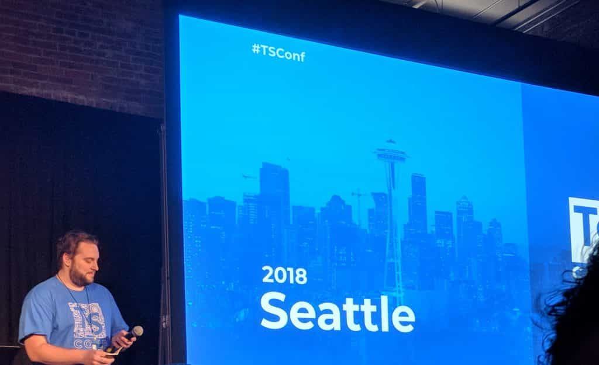

---

title: TypeScript Conf - The Aftermath
published: true
author: Rene Rubalcava
pubDate: 2018-03-19
tags: geodev, typescript
heroImage: '../../assets/blog/typescript-conf-the-aftermath/images/tsconf.png'
description: Last week I had the opportunity to attend the inaugural TSConf in
  Seattle, WA with a few of my Esri buds.
---

Last week I had the opportunity to attend the inaugural
[TSConf](https://tsconf.io/) in Seattle, WA with a few of my Esri buds.

This was the first ever conference focused specifically on
[TypeScript](http://www.typescriptlang.org/). It was also my first time in
Seattle, and I think I happened to be there in an ideal weekend, because it
wasn't even cloudy, and just a little drizzle one morning. It was beautiful out
there! This was a one day event, packed with lots of great talks!

It was a lot of fun, kicked off by a keynote from
[Anders Hejlsberg](https://twitter.com/ahejlsberg) who is the architect for
TypeScript at Microsoft, and has an impressive resume of working in languages.
Anders provided some insight into the early days of TypeScript, some of the
early motivations.

[Josh Thomas](https://twitter.com/jthoms1) of
[Ionic](https://ionicframework.com/) kicked off the first tech presentation to
talk about [StencilJS](https://stenciljs.com/), which is written in TypeScript
and how it is used to create Web Components. This was really interesting and I
thought it was very cool how Stencil can create the HTML related typings for
your web components.

Next up, [Sarah Higley](https://twitter.com/codingchaos) of
[Sitepen](https://www.sitepen.com/) gave us an interesting talk about design and
accessibility when building your apps. The example provided was a simple button,
but how differrent developers may create the interface for this button and what
decisions each may make. It was a fun talk and a good reminder that
accessibility matters.

[Mohsen Azimi](https://twitter.com/mohsen____) of [Lyft](https://www.lyft.com/)
showed a cool presentation on using [Swagger](https://swagger.io/) to build
_Typed_ APIs and do some cool code generation. This was very interresting,
because the types designated via the API are the source of your Types in your
application. I was very intrigued.

We had a cool double team presentation from
[Bowen Ni](https://github.com/bowenni) and
[Radoslav Kirov](https://twitter.com/radokirov) of Google on how TypeScript is
used at Google. There was some really cool info here on scaling TypeScript in a
large org and on large projects, like Angular. There was some really cool
tooling shown in this one!

[Mike Lazer-Walker](https://twitter.com/lazerwalker) talked about how he used
TypeScript to build some interesting games and some of the challenges he faced.
In particular here, your code may work, but hardware is unpredictable!

[David Sherret](https://twitter.com/davidsherret) of
[Synaptive Medical](https://www.synaptivemedical.com/) showed some static
analysis of TypeScript code using the TypeScript compiler. I had a short bout of
using the TS compiler at one point for a test project, and he showed some really
cool stuff to update source code I hadn't considered before.

[Devon Zuegel](https://twitter.com/devonzuegel) of [Bloom](https://bloom.co/)
gave a cool presentation on using TypeScript to validate your Webpack configs
with TypeScript. She also provided some cool samples on how TypeScipt _could
have_ saved from some embarrassing mistakes.

The day was topped off with a sit down with some members of the TypeScript team.
This was recorded for the [TalkScript](https://twitter.com/talkscript) podcast
which I'm sure will be out soon. There was some great questions and answers from
the team here. It was a lot of fun and I look forwarding to listening to it
again.

I should mention, the whole thing was emcee'd by stand-up comedian and part-time
developer [Nick Nisi](https://twitter.com/nicknisi) who provided a plethora of
puns and haikus between each presentation.

I had a great chance to meet some very cool developers and talk to the
TypeScript team. I was glad to see that [Esri](https://twitter.com/esricareers)
was one of the sponsors for this event. We use TypeScript extensively to build
the JavaScript API, so if that sounds like something you're interested in, hit
them up!

I look forward to this event next year! The whole team at
[Sitepen](https://twitter.com/sitepen) did a great job putting the whole thing
together, thanks!
