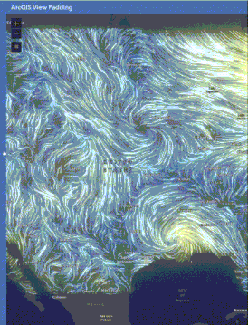

---

title: View Padding in ArcGIS JSAPI
description: How to use View Padding in the ArcGIS API for JavaScript to layout your app
published: true
author: Rene Rubalcava
pubDate: 2022-06-21T10:00:00.000Z
heroImage: '../../assets/blog/view-padding/images/cover.jpg'
tags: javascript, geodev
---

## View your Padding

The
[ArcGIS API for JavaScript](https://developers.arcgis.com/javascript/latest/)
provides several ways to help developers build a user interface. It provides
numerous out-of-the-box widgets, styled using the
[Calcite Design System](https://developers.arcgis.com/calcite-design-system/).
Each View provides a user interface (UI) element that users can use to define
layouts around their map. You can add widgets or your own custom HTML elements.
Sometimes, this can lead to some odd use cases if you want to keep the focus of
your application on the map. That's where view padding comes in!

> The code for this blog is available on
> [github](https://github.com/odoe/jsapi-view-padding).

View padding allows you to offset the center of the map within the UI. It's not
much more complicated than that. This is useful if you want to display a side
panel, or some widgets on one side of the map, but keep the focus on the map.
You can apply some view padding to line things up. As the padding changes, so
does the map's focal center point. Okay, that's fine and all, but how about if
it's a dynamic sidebar with animation? And you want to adjust the padding
dynamically?

_Let's have some fun!_

## Electric Slide

Before we dive into some code, let's talk about what you might want to
accomplish.

1. Show tools in a side panel.
2. Animate side panel drawer.
3. Dynamically adjust view padding with drawer animation.

You can have the side panel start in a negative position, say -280 off the
screen. So you will want to animate the position of the element from -280 to 0.
At the same time, you will want to adjust the view padding to positive 280 to
make room for the element and adjust the center of the map.

Now, math is not one of my greater strengths, at least not when it comes to
stuff like [easing](https://easings.net/) functions, so I'm sure I found much of
this animation function via Google and StackOverflow.

```ts
const margin = -280;

const identity = (a: any) => a;
const duration = 500;
function animate(options = {
  easing: identity,
  onProgress: identity,
  onComplete: identity,
  from: {},
  to: {},
}) {
  const {
    easing,
    onProgress,
    onComplete,
    from,
    to,
  } = options;

  const startTime = Date.now();

  function update() {
    let deltaTime = Date.now() - startTime;
    let progress = Math.min(deltaTime / duration, 1);
    let factor = easing(progress);
    let values = {};

    for (let k in from) {
      if (k) {
        values[k] = from[k] + (to[k] - from[k]) * factor;
      }
    }

    onProgress(values);

    if (progress === 1) {
      onComplete(deltaTime);
    } else {
      requestAnimationFrame(update);
    }
  }

  requestAnimationFrame(update);
}
```

What this function is doing is getting the start time for the animation, so you
can track its progress to completion. As the animation progresses, you can use
[requestAnimationFrame](https://developer.mozilla.org/en-US/docs/Web/API/window/requestAnimationFrame)
to create a smooth animation in JavaScript.

Here are some of the helper methods and the easing function.

```ts
// easing function
function inSine(t: number) {
  return -Math.cos(t * Math.PI / 2) + 1;
}

// update the view padding object
function updatePadding(value: number) {
  return {
    left: value - margin + defaultPadding,
  };
}

// expand the view padding
function expand() {
  animate({
    easing: inSine,
    onProgress({ a }: { a: number }) {
      slider.style.marginLeft = `${a}px`;
      view.padding = updatePadding(a);
    },
    onComplete() {
      btnExpand?.removeEventListener("click", expand);
      btnExpand?.addEventListener("click", collapse);
    },
    from: {
      a: margin,
    },
    to: {
      a: 0,
    },
  });
}

// collapse the view padding
function collapse() {
  animate({
    easing: inSine,
    onProgress({ a }: { a: number }) {
      slider.style.marginLeft = `${a}px`;
      view.padding = updatePadding(a);
    },
    onComplete() {
      btnExpand?.removeEventListener("click", collapse);
      btnExpand?.addEventListener("click", expand);
    },
    from: {
      a: 0,
    },
    to: {
      a: margin,
    },
  });
}

btnExpand?.addEventListener("click", expand);
```

In the application, you can use the edge of the side panel as the button to open
and close the panel. This can be treated like a button with a click event, so
depending on whether or not you opening or closing the panel, you can add and
remove the proper event listeners.



## Summary

Adjusting view padding can be very handy in cases where you want to add a header
to the map view, maybe custom components that have sliding panels and can change
their sizes dynamically during use. _Have some fun with it_, you never know what
you might find.

You can see a walkthrough of this application in the video below!

<lite-youtube videoid="T50ACDSklcM"></lite-youtube>
